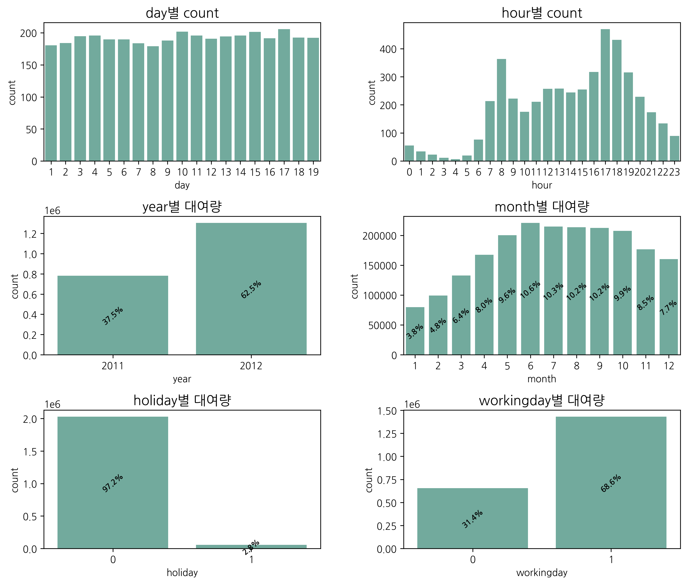
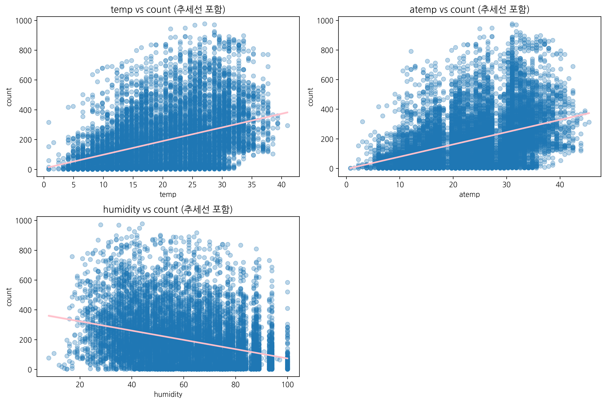
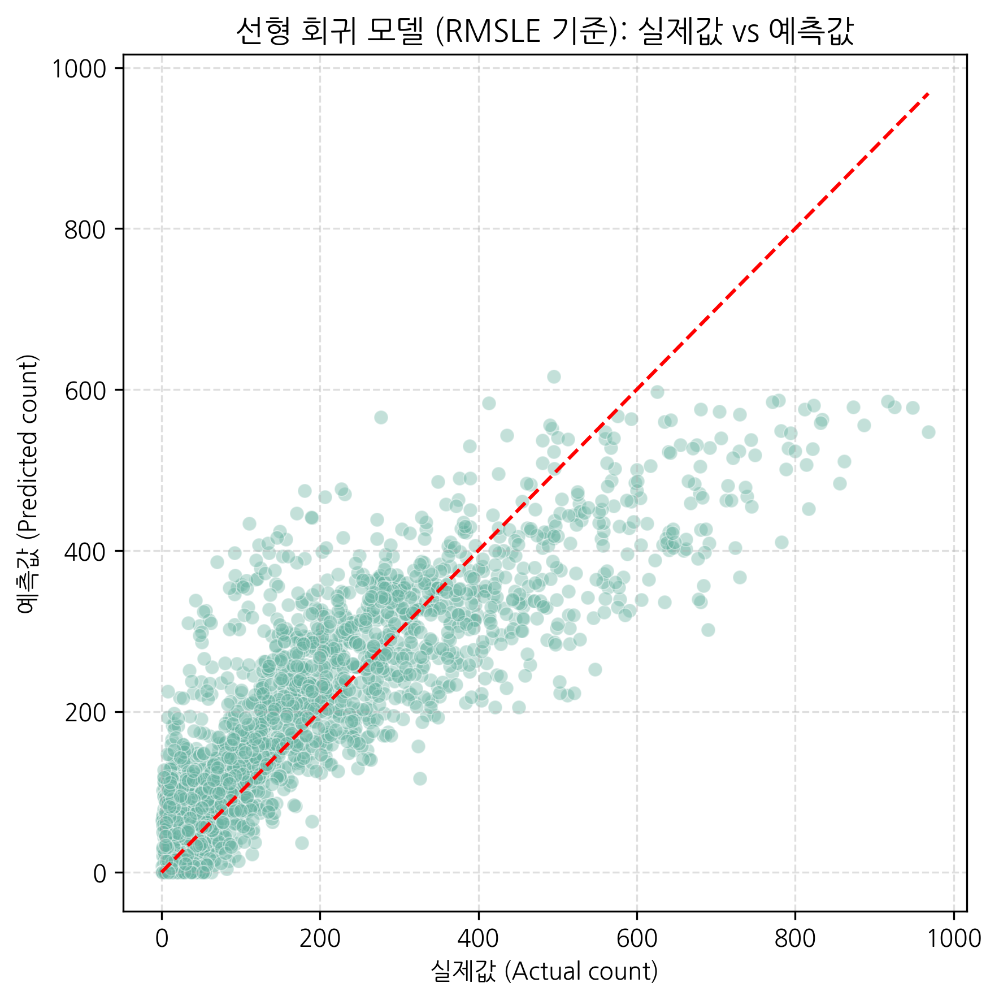

# 🚲 자전거 대여량 수요 예측 분석 보고서

> **프로젝트명:** Bike Sharing Demand Pattern Analysis  
> **작성자:** 이소윤

---

## 1️⃣ 자전거 대여 패턴 분석 (Overview)

### 🎯 목적
- 자전거 대여 데이터의 **패턴을 분석**하고,  
- **시간대·날씨·계절 등 요인별 대여량 변화**를 정량적으로 파악한 뒤,  
- 이를 기반으로 **운영 전략**을 제안한다.

### 📂 데이터 개요
- **출처:** Kaggle - Bike Sharing Demand Dataset  
- **기간:** 2011년~2012년  
- **관측 단위:** 1시간 단위(hourly)  
- **주요 변수**
  | 변수 | 설명 |
  |------|------|
  | datetime | 대여 시점 |
  | season | 계절 (1: 봄, 2: 여름, 3: 가을, 4: 겨울) |
  | weather | 날씨 (1: 맑음, 2: 흐림, 3: 비/눈) |
  | temp / atemp | 온도 및 체감온도 |
  | humidity | 습도 |
  | windspeed | 풍속 |
  | holiday / workingday | 공휴일 / 근무일 여부 |
  | count | 대여량 (타깃) |

---

## 2️⃣ 데이터 전처리 (Data Preprocessing)

### ✅ 이상치,결측치 및 중복치 처리
- `humidity = 0` → 실제 존재 불가능한 값으로 판단, **이상치 제거**
- 결측치, 중복치 없음

### ✅ 파생변수 생성
- `datetime` 열에서 다음 항목을 분리:
  - `year`, `month`, `day`, `hour`
- 범주형 변수는 `get_dummies()`를 활용하여 원핫인코딩

---

## 3️⃣ 가설 세우기 (Hypothesis Formulation)

### 3-1. 가설 1️⃣  
> **평일 출퇴근 시간대에 대여량이 많을 것이다.**

📊 **결과:**  
- 시간대별(hour) 대여량을 분석한 결과,  
  **07~09시와 17~19시**에 뚜렷한 피크가 확인됨.  
- 특히 평일(workingday=1)에서 해당 현상이 두드러짐.

🧩 **해석:**  
> 자전거는 여가용보다 **출퇴근용 교통수단으로 활용되는 경향**이 강함.

---

### 3-2. 가설 2️⃣  
> **날씨가 좋을수록 대여량이 많을 것이다.**

📊 **결과:**  
- weather=1(맑음) 구간에서 평균 대여량이 약 **1.4배 이상** 높음.  
- humidity(습도)가 높거나 windspeed(풍속)가 강할수록 대여량 감소.

🧩 **해석:**  
> 쾌적한 기상 조건(맑음, 온도 20~27°C, 습도 낮음)에서 **대여 수요 급증.**

---

### 3-3. 가설 정리
| 가설 | 검증 결과 | 결론 |
|------|------------|------|
| ① 출퇴근 시간대 대여량 증가 | ✅ 검증됨 | 출퇴근 목적 중심 |
| ② 날씨 좋을 때 대여량 증가 | ✅ 검증됨 | 기상 조건의 영향 큼 |

---

## 4️⃣ 모델 학습 (Modeling)

### 4-1. 선형 회귀 학습 (Linear Regression)
- **입력 변수:** 온도, 습도, 풍속, 계절, 시간대, 근무일 여부 등  
- **타깃 변수:** `count`

#### 📌 ① 기본 선형 회귀 결과

| 지표 | 값 |
|------|------|
| RMSE | 99.62 |

> → 기본적으로 대여 패턴을 잘 설명하지만, 고대여량 구간에서 과소예측 발생

#### 📌 ② 로그 변환 회귀 결과

| 지표 | 값 |
|------|------|
| RMSLE | **0.59** |

> 로그 변환을 통해 대여량 분포의 왜도를 완화,  
> 예측 안정성이 향상됨.
---

## 5️⃣ 운영 전략 제안 (Business Strategy)

### 💡 1. 운영 효율화
- **출퇴근 피크 시간대(08시·18시)** 에 자전거 재배치 강화  
- **비/눈 예보 시** 대여소별 공급량 탄력 조정
- **출퇴근** 이용량이 많은 **지역 데이터 확보**

### 💡 2. 날씨 기반 수요 예측
- 기상 API와 모델 연동 → **시간 단위 수요 예측 시스템 구축**  
- 습도·풍속 데이터 실시간 반영 → 예측 정확도 향상

### 💡 3. 사용자 경험 개선
- **앱 알림 기능:** 날씨 좋을 때 대여 추천  
- **정기 대여 서비스:** 출퇴근 이용자 대상 구독형 요금제

---

## 6️⃣ 결론 (Conclusion)

| 항목 | 내용 |
|------|------|
| **데이터 인사이트** | 계절·시간·날씨 요인이 대여량에 가장 큰 영향 |
| **모델 성능** | RMSLE 0.59 → 앙상블 기법으로 더 최적화 시도 가능 |
| **전략 제안** | 피크타임 재배치 + 기상기반 수요관리 제안 |

✅ **결론:**  
> 자전거 대여량은 날씨와 시간대에 따라 뚜렷한 패턴을 보이며,  
> 로그 변환 및 비선형 모델을 통해 예측 정확도를 크게 향상시킬 수 있다.  
> 향후 실시간 예측 시스템 구축 시, 운영 효율 극대화 가능.

---
