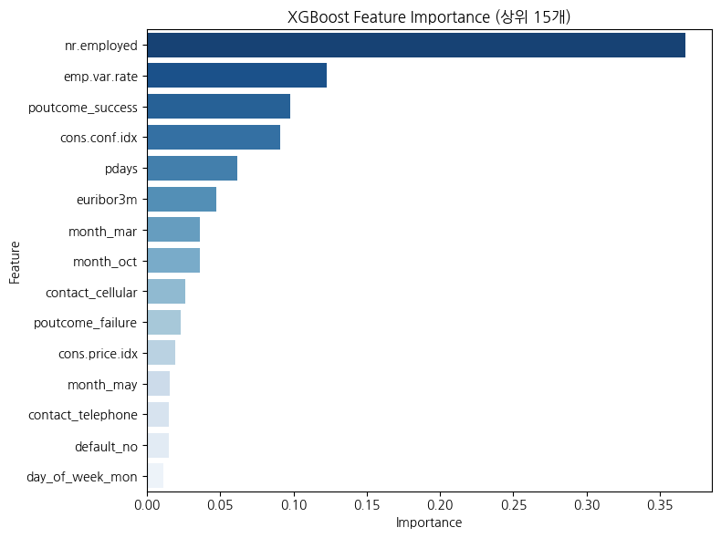

# 🏦 정기 예금 가입 고객 예측 분석 보고서

> **프로젝트 목표:**  
> 은행의 마케팅 캠페인 데이터를 기반으로,  
> **고객의 정기 예금 가입 여부를 예측**하고  
> 예측 결과를 토대로 **효율적인 마케팅 전략을 수립**한다.

---

## 1️⃣ 데이터 전처리
| 컬럼명 | 설명 |
|:--------|:------------------------------------------------|
| age | 나이 (숫자) |
| job | 직업 (범주형) |
| marital | 결혼 여부 (범주형) |
| education | 교육 수준 (범주형) |
| default | 신용 불량 여부 (범주형) |
| housing | 주택 대출 여부 (범주형) |
| loan | 개인 대출 여부 (범주형) |
| contact | 연락 유형 (범주형) |
| month | 마지막 연락 월 (범주형) |
| day_of_week | 마지막 연락 요일 (범주형) |
| duration | 마지막 연락 지속 시간, 초 단위 (숫자) |
| campaign | 캠페인 동안 연락 횟수 (숫자) |
| pdays | 이전 캠페인 후 지난 일수 (숫자) |
| previous | 이전 캠페인 동안 연락 횟수 (숫자) |
| poutcome | 이전 캠페인의 결과 (범주형) |
| emp.var.rate | 고용 변동률 (숫자) |
| cons.price.idx | 소비자 물가지수 (숫자) |
| cons.conf.idx | 소비자 신뢰지수 (숫자) |
| euribor3m | 3개월 유리보 금리 (숫자) |
| nr.employed | 고용자 수 (숫자) |
| y | 정기 예금 가입 여부 ('yes' 또는 'no'로 표시됨) |

### ✅ 주요 처리 내용
| 구분 | 내용 | 근거 |
|------|------|------|
| **결측치 처리** | `pdays`의 999 → NaN으로 변환 | 999는 "이전 캠페인 미참여" 의미 |
| **이상치 처리** | `duration` 제거 | 결과 누출(leakage) 위험 |
| **인코딩** | 범주형 변수 → One-Hot Encoding (`drop_first=True`) | 다중공선성 방지 |
| **데이터 분할** | `train_test_split` (80:20, stratify=y) | 클래스 불균형 고려 |

---

## 2️⃣ 모델링 : 앙상블 기법을 활용

### ⚙️ 비교 모델
- RandomForestClassifier  
- XGBoostClassifier  
- CatBoostClassifier  

### 📊 성능 비교 결과

| 모델 | Accuracy | F1-score | ROC-AUC |
|------|-----------|-----------|-----------|
| **RandomForest** | 0.8924 | 0.6560 | 0.7795 |
| **XGBoost** | **0.8987** | **0.6653** | **0.8007** |
| **CatBoost** | 0.8987 | 0.6594 | **0.8128** |

성능 개선을 위해 그리드서치 하였으나, 모델이 보수적으로 변하며 결과가 더욱 안좋게 나옴.

( Accuracy: 0.8989, F1-score: 0.6128, ROC-AUC : 0.7987 )

> 🎯 **최종 선정:** 기본 XGBoost (n_estimators=300, learning_rate=0.1, max_depth=6,
    subsample=0.8, colsample_bytree=0.8, random_state=42, n_jobs=-1)  
> → 전반적인 예측력(AUC)과 F1 균형이 가장 우수.
---

## 3️⃣ 모델 해석 (Feature Importance)

### 📈 주요 변수 중요도 (상위 15개)

| 변수 | 의미 | 해석 |
|------|------|------|
| **nr.employed** | 고용자 수(경제활동 인구 수) | 경기 호황 시 예금 가입률 상승 |
| **emp.var.rate** | 고용 변동률 | 고용률 상승 → 고객의 재무적 여유 증가 |
| **poutcome_success** | 과거 캠페인 성공 여부 | 이전 응답 고객 재참여 확률 높음 |
| **cons.conf.idx** | 소비자 신뢰지수 | 경제 신뢰도 상승 → 예금 선호 증가 |
| **pdays** | 마지막 캠페인 후 경과일 | 최근 연락 고객일수록 반응률 높음 |
| **euribor3m** | 3개월 유로 금리 | 금리 상승기 → 예금 매력도 증가 |
| **contact_cellular** | 휴대폰 연락 여부 | 휴대폰 고객 응답률이 유선보다 높음 |
| **month_mar/oct/may** | 마케팅 시기 | 봄·가을 시즌 집중 효과 확인 |

---

## 4️⃣ 인사이트 도출

### 💡 가입 고객의 특징 요약
- 최근 연락을 받은 고객 (`pdays` 낮음)  
- 과거 캠페인에 응답한 고객 (`poutcome_success=1`)  
- 휴대폰(`contact_cellular`)으로 연락받은 고객  
- 경제 호황기(`nr.employed`, `emp.var.rate` 상승)  
- 마케팅 집중 월: **3월·5월·10월**

### 💡 비가입 고객의 특징
- 이전 캠페인 미참여 (`pdays=999`)  
- 유선전화(`contact_telephone`)로만 연락  
- 과거 실패 이력 (`poutcome_failure=1`)  
- 경기침체기(`euribor3m`, `cons.conf.idx` 낮음)

---

## 5️⃣ 비즈니스 전략 제안

| 인사이트 | 실행 전략 제안 |
|-----------|----------------|
| 과거 성공 캠페인 고객 재참여율 ↑ | **리타겟팅 캠페인** (이전 응답 고객 우선) |
| 휴대폰 고객 응답률 ↑ | **모바일·전화 마케팅 강화**, 유선 채널 축소 |
| 시즌별 가입률 차이 존재 | **봄·가을 집중 프로모션** 실시 |
| 최근 연락 고객 반응 ↑ | **최근 접촉자 우선 타겟팅** (pdays 기반) |
| 신용불량 이력 無 고객 ↑ | **우량 고객 전용 장기 예금 상품** 설계 |
| 경기지표와 연동 | **금리·고용률 지표 기반 마케팅 타이밍 조정** |

---

## 6️⃣ 결론

> 본 분석을 통해,  
> XGBoost 모델은 정기 예금 가입 여부를 약 **90%의 정확도(Accuracy)** 로 예측하였다.  
> 다만, **F1-score(약 0.66)** 가 상대적으로 낮게 나타난 점은  
> **‘가입 고객(Positive)’의 비율이 적은 불균형 데이터 특성**에 기인한 것으로 보인다.  
>  
> 이는 모델이 전체 정확도는 높지만, 실제 가입 고객을 놓칠 가능성이 있음을 시사한다.  
> 따라서 향후에는  
> - **SMOTE 등 데이터 균형화 기법 적용**,  
> - **Threshold 조정 및 Recall 중심의 모델 재학습**,  
> - **SHAP 기반 세밀한 변수 해석**  
> 등을 통해 **‘실제 가입 고객을 더 정확히 찾아내는 모델’** 로 개선할 수 있을 것이다.  
>  
> 종합적으로, 본 분석은 은행 마케팅 전략 수립에 있어  
> **“정확도 중심 예측 모델 + 행동 기반 고객 세분화 전략”** 의 가능성을 제시하였다.

